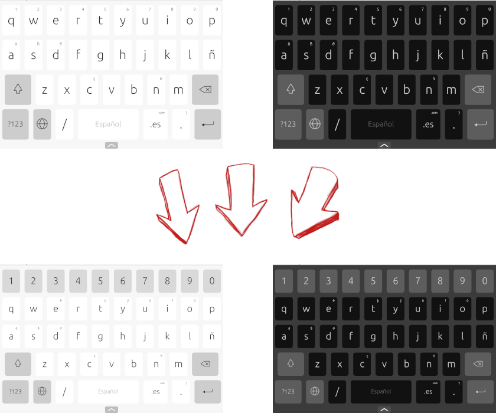

# comfy-keyboard

Simple patch to improve the appearance of the Ubuntu Touch keyboard.



### How to run

[Enable ssh](https://docs.ubports.com/en/latest/userguide/advanceduse/ssh.html) or [enable developer mode](https://docs.ubports.com/en/latest/userguide/advanceduse/adb.html). **This is important!** If something goes wrong and your keyboard stops working, you may lose access to your device. You need a plan B in case that happens.

Download all the files from this repository (if you don't know how to do that, you probably shouldn't use it) and place them somewhere in your device. Then run the script as the root user. If your device is running 16.04 (xenial):

```
$ sudo su
# ./run_xenial.sh
```

If your device is running 20.04 (focal):

```
$ sudo su
# ./run_focal.sh
```

The script should do its job in radio silence. Reboot to see your changes:

```
# reboot
```

If nothing has gone wrong, you should have a keyboard with smaller keys and a comfortable top row with numbers. The modifications may be overwritten by a system update. If that happens, repeat the process.

If you can't see your keyboard or something has gone wrong, however...

### How to revert

Run the restore script as root and reboot.

16.04 (xenial):

```
$ sudo su
# ./restore_xenial.sh
# reboot
```

20.04 (focal):

```
$ sudo su
# ./restore_focal.sh
# reboot
```

### [N-O-W-A-R-R-A-N-T-Y RANT]

Consider this to be **experimental and highly unstable**. Your system is normally in read-only mode. This script remounts your filesystem as read-write and modifies some files. **It could break anytime soon**. Back up your data regularly and assume you might have to ssh into your device (or worse) to fix your stuff in the future (you listened to me and enabled ssh, right? Right?).
